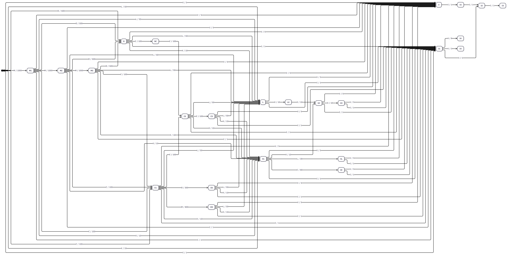

# roman-numeral-transducer

A Ruby implementation of a [transducer](https://en.wikipedia.org/wiki/Transducer) for converting roman numerals to decimal.

## Usage

To run the program interactively, run:

```bash
ruby roman-numeral-transducer.rb
```

## Modelling

The transducer consists of a [DFA](https://en.wikipedia.org/wiki/Deterministic_finite_automaton) that generates a sequence of decimal numbers, the sum of which is the roman numeral converted to decimal.

It is using the [Mealy machine](https://en.wikipedia.org/wiki/Mealy_machine) model since it is simpler to implement.

### Input Alphabet

$\Sigma = \lbrace I, V, X, L, C, D, M \rbrace$

### Output Alphabet

$\Sigma = \lbrace 0, 1, 2, 3, 4, 5, 6, 7, 8, 9 \rbrace$

### Transition Diagram


